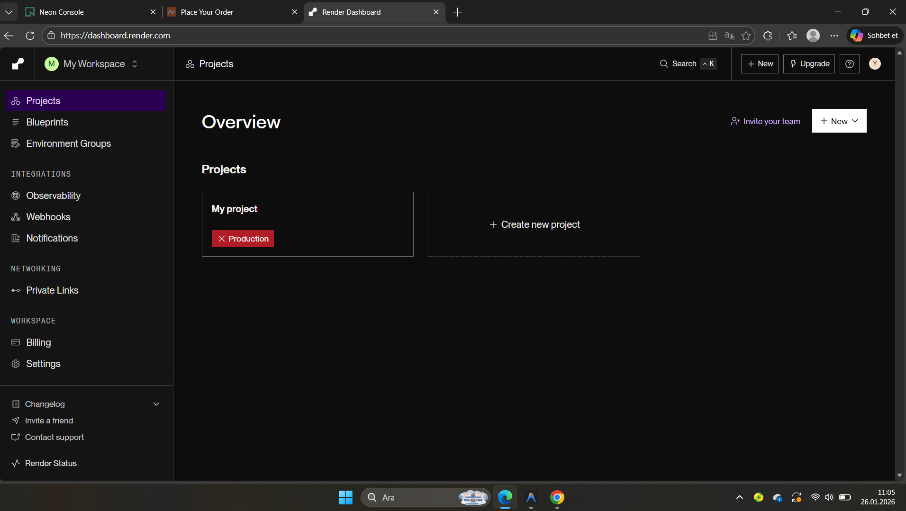

# 🌐 Render.com Üzerinden Yayına Alma Rehberi

Net Muhasebe AI uygulamanızı Render.com üzerinde ücretsiz veya düşük maliyetli olarak yayına almak için bu adımları takip edin.

## 1. Hazırlık
Uygulamanız şu an canlıya çıkmaya hazır durumdadır. Tüm "PRO" kısıtlamaları kaldırılmış ve tasarım modernize edilmiştir.

## 2. Render.com Ayarları

### Dashboard Üzerinde:
1. **New+** -> **Web Service** seçeneğine tıklayın.
2. GitHub/GitLab deponuzu bağlayın.
3. Uygulama ayarlarını şu şekilde yapın:
   - **Name:** `net-muhasebe-ai`
   - **Environment:** `Node`
   - **Build Command:** `npm install && npm run build`
   - **Start Command:** `npm start`

### 3. Ortam Değişkenleri (Environment Variables)
Render panelindeki **Environment** sekmesine şu değişkenleri ekleyin:

| Key | Value | Açıklama |
|-----|-------|----------|
| `DATABASE_URL` | `postgresql://...` | Mevcut Neon DB bağlantı adresiniz |
| `JWT_SECRET` | `rastgele-guclu-bir-sifre` | Güvenlik için rastgele bir anahtar |
| `NODE_VERSION` | `18.0.0` | (Opsiyonel) |

## 4. Özel Alan Adı (netmuhasebe.net.tr)
1. Render panelinde **Settings** -> **Custom Domains** bölümüne gidin.
2. `netmuhasebe.net.tr` adresini ekleyin.
3. Size verilen CNAME veya A kayıtlarını alan adı panelinizden (Reg.com.tr, GoDaddy vb.) güncelleyin.

## 5. Ücretsiz Tier İçin İpucu (Uyanık Tutma)
Render ücretsiz servisleri 15 dakika işlem olmazsa "uyku" moduna geçer. Uygulamanın her zaman hızlı açılması için:
- [Cron-job.org](https://cron-job.org) gibi bir servis kullanarak her 10 dakikada bir ana sayfanıza (`https://netmuhasebe.net.tr`) bir istek (ping) gönderilmesini sağlayabilirsiniz.

---
**Destek:** Herhangi bir sorun yaşarsanız 534 740 12 56 numaralı hattan teknik destek alabilirsiniz.
